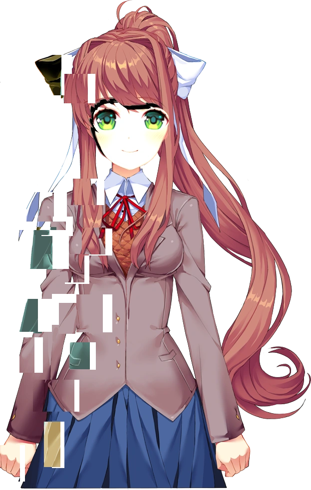
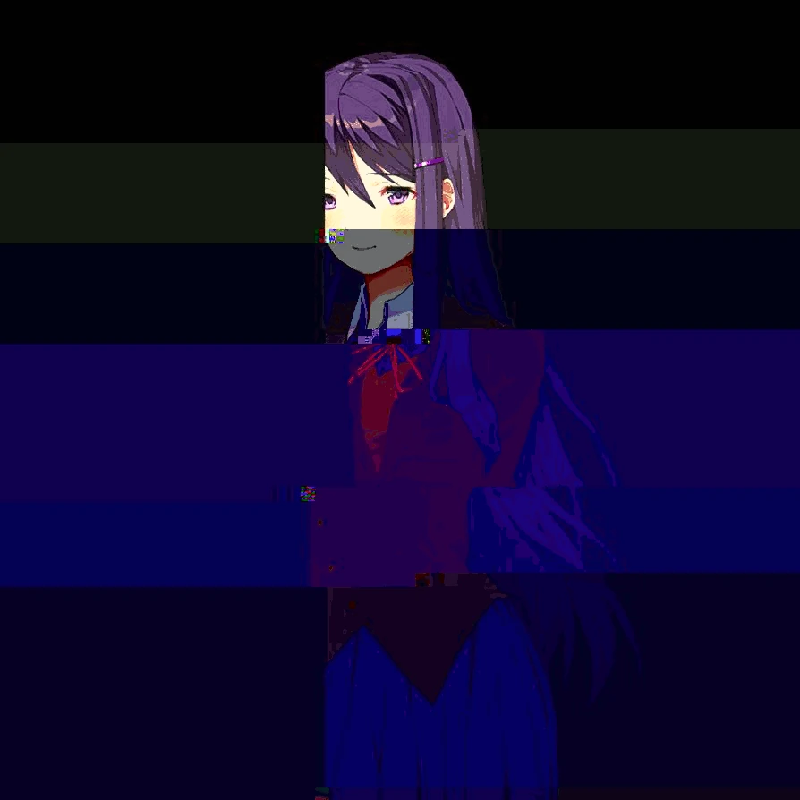

<h1 align="center">DDLC Chibi Themes</h1>

<p align="center">
  
</p>

<p align="center">
  <strong>Dark themes and Doki chibis for IDEs with a modern code-editor workflow.</strong>
</p>

<p align="center">
  A fan-made extension inspired by Doki Doki Literature Club</a>, created to make the development environment more thematic and welcoming.
</p>

<p align="center">
  <a href="https://www.typescriptlang.org/" title="TypeScript">
    
  </a>
  <a href="https://nodejs.org/" title="Node.js">
    
  </a>
  <a href="https://www.npmjs.com/" title="npm">
    
  </a>
  <a href="https://developer.mozilla.org/docs/Web/HTML" title="HTML">
    
  </a>
  <a href="https://developer.mozilla.org/docs/Web/CSS" title="CSS">
    
  </a>
</p>

### Hello, my name is Visel ^\_^. Enjoy this extension and check out the structure or the README file <3.

- Yuri, she's so cute 💜.

## About

DDLC Extension adds four dark themes inspired by the Dokis and a Webview View inside the Explorer. When the IDE color theme changes, the extension automatically detects the matching Doki and displays her chibi together with a short phrase.

The chibi stays separate from the open code and does not require manual character selection.

## Features

- Four dark themes inspired by the Dokis.
- Automatic character switching based on the active theme.
- A Webview View named `DDLC: Doki Chibis`.
- PNG chibis paired with individual `.txt` phrases.
- Visual content kept outside the main editing area.
- Compatibility with IDEs that support extensions and Webviews.

## Dokis and Themes

| Theme                 | Doki       | Style                     | Chibi              |
| --------------------- | ---------- | ------------------------- | ------------------ |
| `DDLC - Monika Dark`  | 💚 Monika  | Confident and charismatic | `chibimonika.png`  |
| `DDLC - Sayori Dark`  | 💙 Sayori  | Cheerful and warm         | `chibisayori.png`  |
| `DDLC - Natsuki Dark` | 💗 Natsuki | Direct and charming       | `chibinatsuki.png` |
| `DDLC - Yuri Dark`    | 💜 Yuri    | Elegant and mysterious    | `chibiyuri.png`    |

## Generated Extension

```bash
npm run compile
vsce package
```

### Marketplace

```bash
IDE --install-extension ddlc-fan.ddlc-themes
```

### Open VSX

```bash
IDE --install-extension ddlc-fan.ddlc-themes
```

### Local VSIX package

```bash
IDE --install-extension ./ddlc-extension.vsix
```

## How the Chibi Works

The image and phrase share the same base name inside the `chibis/` folder:

```text
chibis/
|- chibimonika.png
|- chibimonika.txt
|- chibisayori.png
|- chibisayori.txt
|- chibinatsuki.png
|- chibinatsuki.txt
|- chibiyuri.png
`- chibiyuri.txt
```

When `DDLC - Yuri Dark` is active, the extension loads:

```text
chibis/chibiyuri.png
chibis/chibiyuri.txt
```

## Credits

This is an unofficial fan-made extension. Credit for the original universe belongs to:

- [Doki Doki Literature Club](https://ddlc.moe/)
- [Team Salvato](https://teamsalvato.com/)
- [Dan Salvato](https://dansalva.to/)

## Thank You

Thank you for checking out DDLC Chibi Themes and for spending some time with this little fan project ❤️.

Thank you to everyone who tests the extension, shares suggestions, and helps make the IDE a little more "Doki".

<br><br><br><br><br><br><br><br><br><br><br><br><br><br><br><br>

<details>
<summary>Объект :: ÿÇÿ :: 0x00</summary>

<br>

ÿÇÿÇÿÇÿÇÿÇÿÇÿÇÿÇÿÇ

Объект: файл не читается :: 404 :: ؤظػصؽ

¡¡¡ повреждение ¡¡¡

продолжение :: система :: ÿÿÿ

<details>
<summary>Моника :: Моника :: 01</summary>



</details>

<br>

<details>
<summary>Саеори :: Саеори :: 02</summary>


</details>

<br>

<details>
<summary>ÐќÐ°Ñ†ÑƒÐºÐ¸ :: Кацуки :: 03</summary>


</details>

<br>

<details>
<summary>Юри :: Юри :: 04</summary>



</details>

конец :: неизвестно :: ÿÇÿ

</details>
