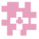
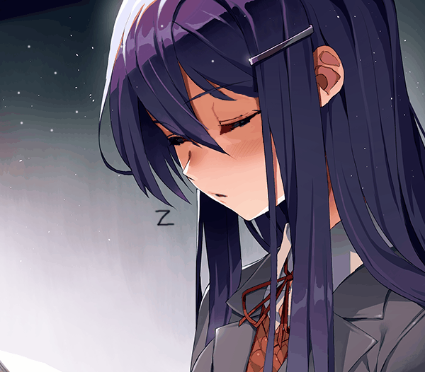

<div align="center">

# DDLC Chibi Themes


### Dark themes and Doki chibis for IDEs with a modern code-editor workflow

*A fan-made extension inspired by* [*Doki Doki Literature Club*](https://ddlc.moe/)*, created to make the development environment more thematic and welcoming.*

<a href="https://www.typescriptlang.org/" title="TypeScript">
  
</a>
<a href="https://nodejs.org/" title="Node.js">
  
</a>
<a href="https://www.npmjs.com/" title="npm">
  
</a>
<a href="https://developer.mozilla.org/docs/Web/HTML" title="HTML">
  
</a>
<a href="https://developer.mozilla.org/docs/Web/CSS" title="CSS">
  
</a>

<sub>fan-made · not affiliated with Team Salvato · made with love</sub>

</div>

---

### Hello, my name is Visel ^_^

Look at this extension and check out the structure or the README file <3

> Yuri, she's so cute 💜. *(I am a Yuri lover >u<)*

<br>

## About

**DDLC Extension** adds four dark themes inspired by the Dokis and a Webview View inside the Explorer. When the IDE color theme changes, the extension automatically detects the matching Doki and displays her chibi together with a short phrase.

The chibi stays separate from the open code and does not require manual character selection.

<br>

## Features


- Four dark themes inspired by the Dokis.
- Automatic character switching based on the active theme.
- A Webview View named `DDLC: Doki Chibis`.
- PNG chibis paired with individual `.txt` phrases.
- Custom Literature Club product icons for the IDE chrome.
- Visual content kept outside the main editing area.
- Compatibility with IDEs that support extensions and Webviews.

<br>

## Product Icons

**DDLC Literature Club Icons** is a full product icon theme: the little glyphs that show up in the Activity Bar, status bar, menus, and editor chrome. Instead of the default Codicons, you get a soft Literature Club set — same layout, more heart.

Activate it with **Preferences: Product Icon Theme** → `DDLC Literature Club Icons`.

Here is a taste of the set, woven into the places you already look at every day:

When you open the Explorer you will meet

`files`, and searching the workspace brings

`search`. The integrated terminal uses

`terminal`, while Debug and Extensions keep their usual spots with

`debug-alt` and

`extensions`. Account and settings stay recognizable as

`account` and

`settings-gear`, Source Control keeps

`source-control`, and yes — there is a little

`heart` in the clubhouse too.

The icons are shipped as an icon font (`producticons/ddlc-icons.woff`) built from the SVG sources under `producticons/svg/`. The build pipeline keeps metrics friendly for VS Code forks (Cursor, Antigravity, and friends) and scales the artwork so the glyphs read clearly at IDE size.

<br>

## Dokis and Themes

<div align="center">

| Theme | Doki | Style | Chibi |
|:---:|:---:|:---:|:---:|
| `DDLC - Monika Dark` | 💚 **Monika** | Confident and charismatic | `chibimonika.png` |
| `DDLC - Sayori Dark` | 💙 **Sayori** | Cheerful and warm | `chibisayori.png` |
| `DDLC - Natsuki Dark` | 💗 **Natsuki** | Direct and charming | `chibinatsuki.png` |
| `DDLC - Yuri Dark` | 💜 **Yuri** | Elegant and mysterious | `chibiyuri.png` |

</div>

<br>

## Installation


### Generated Extension

```bash
npm run compile
vsce package
```

### Marketplace

```bash
IDE --install-extension ddlc-fan.ddlc-themes
```

### Open VSX

```bash
IDE --install-extension ddlc-fan.ddlc-themes
```

### Local VSIX package

```bash
IDE --install-extension ./ddlc-extension.vsix
```

<br>

## How the Chibi Works

The image and phrase share the same base name inside the `chibis/` folder:

```text
chibis/
|- chibimonika.png
|- chibimonika.txt
|- chibisayori.png
|- chibisayori.txt
|- chibinatsuki.png
|- chibinatsuki.txt
|- chibiyuri.png
`- chibiyuri.txt
```

When `DDLC - Yuri Dark` is active, the extension loads:

```text
chibis/chibiyuri.png
chibis/chibiyuri.txt
```

<br>

## Interactive Dialogue System

The sidebar now features a fully interactive visual novel style dialogue system where you can chat directly with the Dokis!

Here is how the new system works in detail:

- **Event-driven Reactions:** The Dokis are aware of your workflow. They will react with specific dialogues and emotions when you perform actions in the IDE, such as saving a file, opening a terminal, encountering an error, creating/deleting files, or even when you are just idle.
- **Random Conversations:** You can initiate a conversation at any time by clicking the "Chat..." button. The Doki will pick a random topic to talk about.
- **Interactive Choices:** During certain conversations, you will be presented with multiple choices on how to respond. The buttons provide visual feedback when pressed, and your selected choice will dictate the Doki's reply and her next emotional sprite.
- **Dynamic Sprites:** The Doki's sprite changes smoothly with a fade effect to match her current emotion (happy, thinking, surprised, reflective, etc.) based on the context of the conversation.
- **History & Localization:** The UI includes a history panel to show recent dialogue lines, and supports changing languages (EN, PT-BR, ES) on the fly via the language selector buttons.
- **Personal & Meaningful Conversations:** Engage in deeper, more intimate conversations with romantic and heartfelt undertones. The Dokis discuss emotional closeness, quiet moments together, vulnerability, and reassurance — each offering 3 distinct choices for you to reply and see their reactions.

### Deeper & Personal Conversations

Beyond everyday coding reactions, you can connect with the Dokis on a deeper emotional level:

- **Intimate Topics:** Heartfelt conversations covering trust, comfort, vulnerability, and romantic undertones.
- **Tailored Personalities:** Each girl reflects her distinctive charm — Monika's attentive warmth, Sayori's sweet encouragement, Natsuki's tsundere sincerity, and Yuri's poetic intimacy.
- **3 Choices for Every Question:** Every question gives you 3 distinct ways to reply, each triggering unique responses and expressive emotion sprites.

<br>

## Gallery

<div align="center">

### Monika


### Natsuki


### Sayori


### Yuri


</div>

---

## Credits

This is an unofficial fan-made extension. Credit for the original universe belongs to:

- [Doki Doki Literature Club](https://ddlc.moe/)
- [Team Salvato](https://teamsalvato.com/)
- [Dan Salvato](https://dansalva.to/)

<br>

## Thank You

Thank you for checking out DDLC Chibi Themes and for spending some time with this little fan project ❤️.

Thank you to everyone who tests the extension, shares suggestions, and helps make the IDE a little more "Doki".

<div align="center">

### Enjoy! :3



</div>

<br><br><br><br><br><br><br><br><br><br><br><br><br><br><br><br>

<details>
<summary>Объект :: ÿÇÿ :: 0x00</summary>

<br>

ÿÇÿÇÿÇÿÇÿÇÿÇÿÇÿÇÿÇ

Объект: файл не читаетÑÑ :: 404 :: ؤظػصؽ

¡¡¡ ÿþòрõöôõýøõ ¡¡¡

продолжение :: ÑиÑтема :: ÿÿÿ

<details>
<summary>Моника :: Ãœþýøúð :: 01</summary>


</details>

<br>

<details>
<summary>Саеори :: áðõþÀø :: 02</summary>


</details>

<br>

<details>
<summary>ÐќÐ°Ñ†ÑƒÐºÐ¸ :: ÚðÆуúø :: 03</summary>


</details>

<br>

<details>
<summary>Юри :: îрø :: 04</summary>


</details>

úþýõц :: ýõø÷òõÑÂтýþ :: ÿÇÿ

</details>